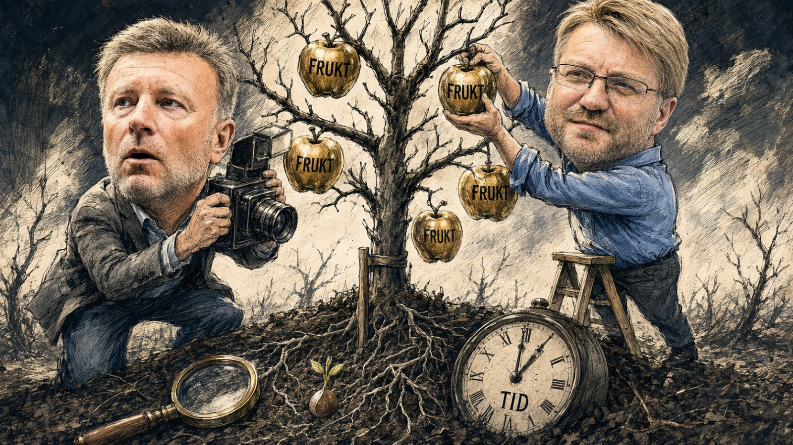

Status: PUBLISERINGSKLAR · klar lørdag 22. august kl. 05.00 · nett mandag 24. august
Tittel: Dagen slo fast kursskiftet. Grunnlaget står ubesvart
Kategori: Norge
Publisert: 2026-08-24
Ingress: 20. oktober 2025 slo Dagen fast at Johan Slåttavik hadde skiftet kurs. 13. april 2026 skrev samme avis at folk var livredde for å kritisere ham. 17. august kalte Selbekk kursskiftet noe Slåttavik «påstod». Hva bar den første tittelen?

20\. oktober 2025 satte Dagen en overskrift som ikke var et sitat: «En av Norges mest beryktede høyreekstremister har skiftet kurs.» Portrettet sto i Korsets Seier, skrevet av Espen Ottosen, og Dagen løftet det med sin egen konstatering i tittelen.

Fortiden var med. Leseren fikk vite at Slåttavik hadde vært knyttet til høyreekstremisme, og at han nå talte om omvendelse og om å elske fienden. Dette var ingen hvitvasking. Portrettet malte et bilde av mørket, men dro raskt to streker under det rosenrøde svaret.

Mantelen er av den oppfatning at «Slåttavik sier at han har skiftet kurs» og «Slåttavik har skiftet kurs» er to betydelig ulike setninger. Den første forteller hva han sier. Den andre slår fast at det stemmer, og da må avisen ha eget belegg.

Vårt Land gikk senere inn i saken. Kildene deres hevdet at Dagen lot seg bruke, og at folk som uttalte seg kritisk, ble truet. Det er påstander, ikke fastslåtte fakta.

Selbekk svarte 1. november med en leder som anklaget Vårt Land for brunbeising og for å utlevere en sårbar kilde. Avisen forsvarte retten til å fortelle om et menneske som sier han har brutt med en destruktiv fortid. Den advarte mot en offentlighet der en tidligere høyreekstremist aldri får lov til å forandre seg.

Advarselen er nødvendig. Kristne som mener alvor med omvendelse, kan ikke behandle et menneskes fortid som en livstidsdom. Pressen skal kunne møte et vitnesbyrd med åpenhet. Åpenheten fritar likevel ingen redaksjon fra å skille personens fortelling fra avisens funn.

13\. april 2026 kom Dagens egen oppfølging: «Folk er livredde for å kritisere Johan Slåttavik.» Avisen gjenga da alvorlige motpåstander om frykt og om fortsatt bruk av «gamle metoder». Motpåstandene er ikke bevist og gjør ikke omvendelsen falsk, men de legger likevel press på oktober-tittelen til å gå over faktagrunnlaget en ekstra gang.

Dagen fortjener anerkjennelse for å ha trykket motbildet. En redaksjon som går tilbake og undersøker, viser mer integritet enn en som verner sitt første oppslag. Oppfølgingen opphever ikke spørsmålet. Den skjerper det: Hvilke uavhengige opplysninger lå til grunn i oktober?

17\. august samme år svarte sjefredaktør Vebjørn Selbekk. «Jeg kommer til å svare generelt på det som tas opp her, ikke så detaljert som det etterspørres,» innledet han. Om denne saken skrev han: «Intervjuet med Johan Slåttavik er i etterkant fulgt opp med en nyhetsartikkel. Der stilles det spørsmål ved om Slåttavik virkelig har endret praksis slik han påstod i den første saken.»

Svaret er reelt. Dagen fulgte opp og stilte spørsmålene. Legg samtidig merke til hvem som eier ordene. I april skrev Dagen tydelig at motpåstandene kom fra kildene, i oktober tok avisen selv regningen. Nå synes det for Mantelen som om Selbekk legger det hele over på Slåttavik med: han «påstod». Formuleringen avisen slo fast på egen kjøl, omtaler sjefredaktøren i dag som intervjuobjektets påstand.

Fire spørsmål står ubesvart. Hvilke uavhengige opplysninger bar konstateringen? Var redaksjonen kjent med motpåstander før 20. oktober? Står Dagen ved tittelen? Ble standarden Selbekk selv formulerte i Kringkastingsrådet i 2016 fulgt, den han ga ordene «Han har meget ekstreme synspunkter, derfor er det ekstra viktig å stille de kritiske spørsmålene»?

*KI-generert bilde*

Johannes døperen ba om frukt som svarer til omvendelsen (Matt 3,8). Sakkeus knyttet møtet med Jesus til oppgjør og tilbakebetaling (Luk 19,8). Paulus talte om gjerninger som svarer til omvendelsen (Apg 26,20). Ingen av tekstene gir journalisten rett til å dømme hjertet. De viser at offentlig troverdighet kan prøves gjennom handling og ansvar over tid.

Fire merker hører hjemme i slike portrett. Bekjent; hva personen selv sier. Bekreftet; det redaksjonen har kontrollert uavhengig. Uavklart; dette er bestridt eller ikke ferdig undersøkt. Frukt; påvist oppgjør og varig endring over tid.

Et slikt skille dømmer ingen omvendelse som falsk. Det verner leseren og den som forteller. Er Slåttaviks omvendelse sann, tåler den å vente på sin overskrift.

Dagen kan holde bekjennelse og prøving sammen. Da avisen intervjuet Tommy Robinson, var overskriften hans egne ord: «Jeg har tatt imot Jesus som min frelser.» Selbekk har fortalt at han spurte om troen hadde endret Robinsons syn på muslimer, og Ottosen skrev senere kritisk om Robinsons bok. Slåttavik-saken reiser derfor et smalt spørsmål: Hvorfor gikk akkurat denne overskriften fra personens fortelling til avisens konklusjon?

Kristen tro gir grunn til håp om at mennesker kan forandre seg. Journalistikk krever belegg før redaksjonen slår fast at det har skjedd. Et vitnesbyrd kan trykkes samme dag. En konstatering må tåle dokumentasjonen som finnes og tiden som viser frukten.

Hva tittelen bar, er det fortsatt Dagen som kan svare på.

Dette er første del i Mantelens serie om Dagens redaksjonelle kurs.

Kilder:

- Dagen, 20. oktober 2025: «En av Norges mest beryktede høyreekstremister har skiftet kurs» (portrett fra Korsets Seier, Espen Ottosen)
- Dagen, leder 1. november 2025, svar til Vårt Land
- Vårt Lands dekning av Slåttavik-saken, høsten 2025
- Dagen, 13. april 2026: «Folk er livredde for å kritisere Johan Slåttavik»
- Vebjørn Selbekk i Kringkastingsrådet, 2016
- Dagens intervju med Tommy Robinson og Ottosens senere bokomtale
- Matt 3,8; Luk 19,8; Apg 26,20 (Bibel 2011)
- E-post fra Vebjørn Selbekk til Mantelen, 17. august 2026 kl. 16.04

Kontrollpunkter før slipp: Illustrasjon til frukt-avsnittet er satt inn (bilder/22.08.26.jpeg) med merkelinjen «KI-generert bilde». Lenker settes inn fra kilderegisteret; ingen er diktet her. Slåttavik-sidene sjekkes på nytt samme dag som slipp. Sitatmarkeringen «gamle metoder» kontrolleres ordrett mot aprilsaken. Publiseringsdato er satt til mandag 24. august; nyhetsbrevet lørdag 22. holder varselets løfte om publisering tidligst onsdag 19. Artikkelen skal være publiseringsklar senest lørdag 22. august kl. 05.00.
